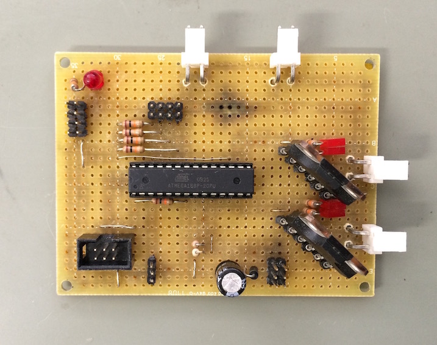

# 2chMotorDriver
２つのDCモータを制御可能な基板

## IO
- PWM入力 x2 (制御信号)
- ディジタル入力 x2 (リミットスイッチ)
- DCモータ出力 x2 個分
- シリアル通信ポート
- AVR ISP 書き込みポート

## 仕様

TPIPのPWM信号を入力に取り、そのデューティ比に応じて出力が変わる

デューティ比 50%でストップするはず

ディジタル入力をHighにすると対応するモータの出力が停止する

この回路を二つ単一ブレッドボード上に並べた4ch基板も存在する

## TODO

- Atmel Studio Project/ Linux等用Makefile を作る
- 回路の実装図を追加する
- プログラムのリファクタリング
